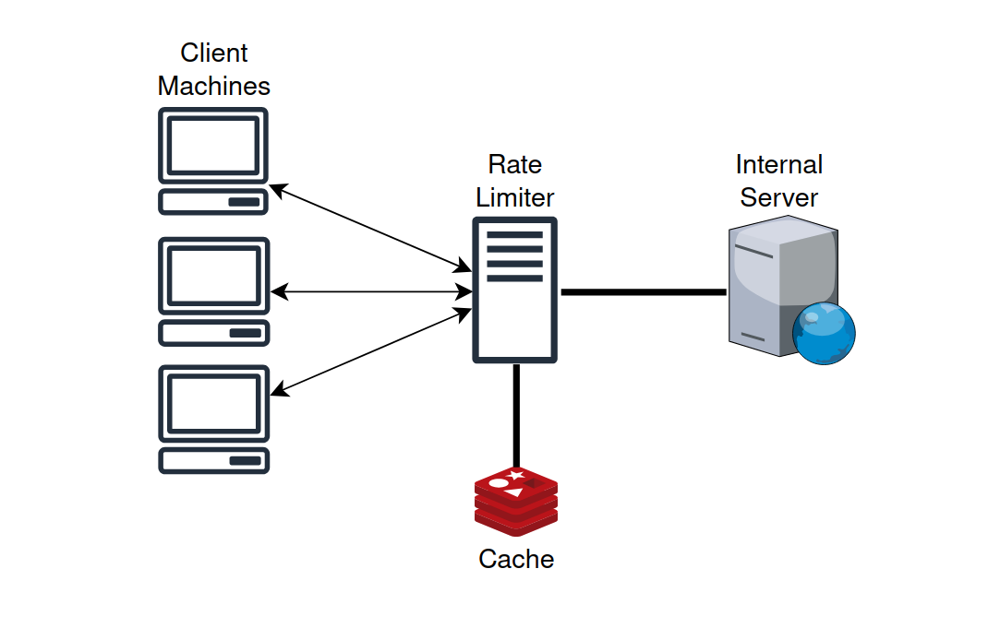
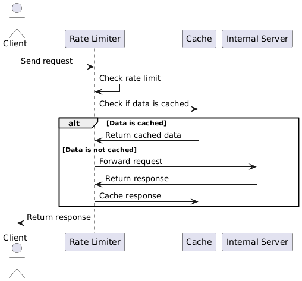

# Rate Limiter

The **Rate Limiter** is a server that acts as a **middleware** between clients and an internal backend. It focuses on controlling the rate at which incoming requests are processed to ensure fair usage, prevent abuse, and protect the backend from overload or DDoS attacks.

## Request Processing Flow

The internal working of the Rate Limiter involves several key steps.

1. **Client Sends Request**: The client initiates a request to the Rate Limiter server.
2. **Rate Limit Check**: The Rate Limiter checks whether the client has exceeded the allowed rate limit. If the rate limit is exceeded, it returns a `429 Too Many Requests` response.
3. **Cache Check**: If the rate limit is not exceeded, the Rate Limiter checks whether the requested data is already available in the cache.
   - If **cached**, the Rate Limiter returns the cached data to the client.
   - If **not cached**, the Rate Limiter forwards the request to the internal server.
4. **Forward to Internal Server**: If the data is not in the cache, the request is forwarded to the internal server.
5. **Cache Response**: Once the internal server responds, the data is cached for future requests.
6. **Return Response**: Finally, the response is sent back to the client.

The following diagram visualizes this process:

